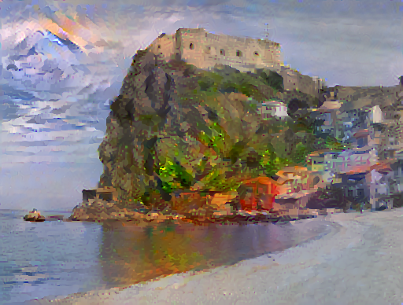
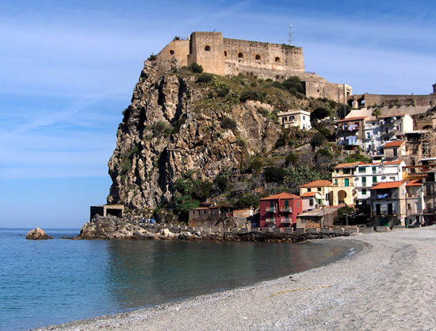
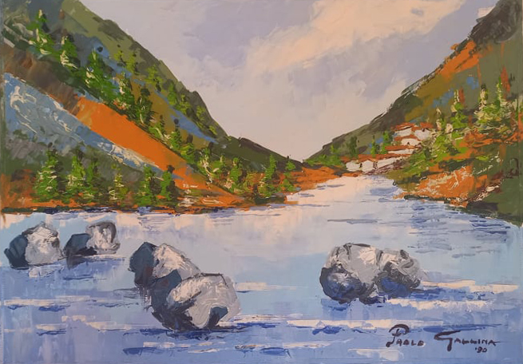

# Scilla
This NFT is produced by a neural network.

This neural network exploit the artistic style of the Calabresian painter **[Paolo Gallina](http://www.cn24tv.it/news/205956/l-intera-comunita-rossanese-piange-il-maestro-paolo-gallina.html)** to paint **Scilla** city

## Output

The following image:

Is generated by a neural network. And in particular it takes as input an image of Tropea and apply as style, the style of the **Paolo Gallina** painting.

See [input](#input) below section for more details

## Input
This NFT take as input 2 images:

### Content modified with the style of Paolo Gallina painter

### Style used to modify
The style to apply is taking form the below painting representation of the famous opera of Orfeo Reda:
