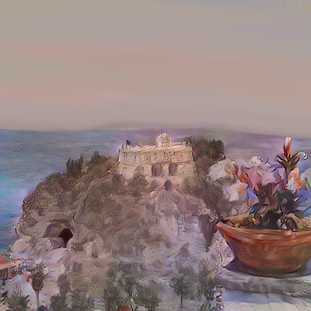
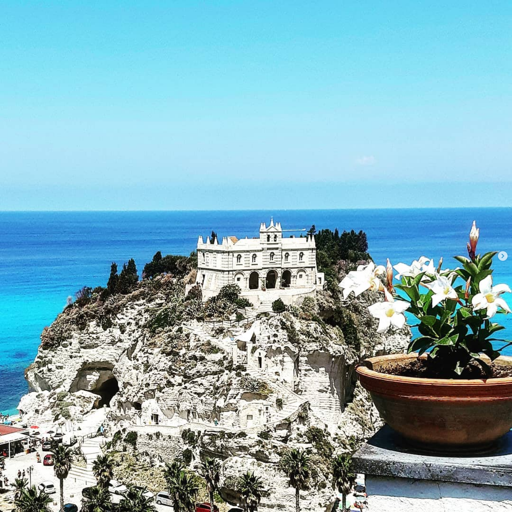
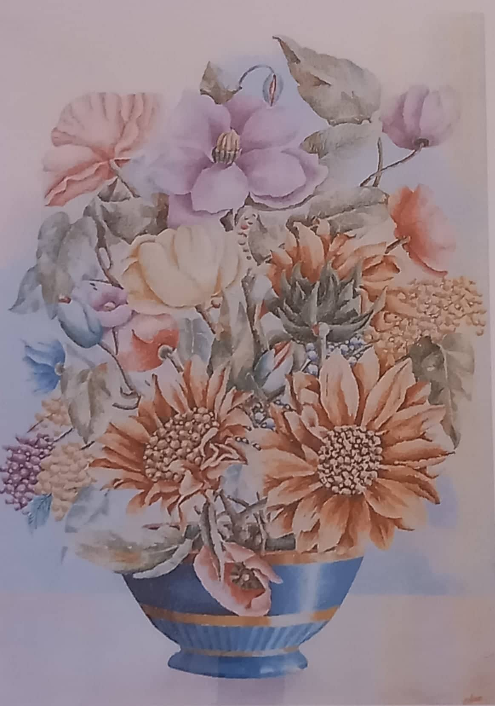

# Tropea
This NFT is produced by a neural network.

This neural network exploit the artistic style of the Calabresian painter **[Orfeo Reda](https://en.wikipedia.org/wiki/Orfeo_Reda)** to paint **Tropea** city

## Output

The following image:

Is generated by a neural network. And in particular it takes as input an image of Tropea and apply as style, the style of the **Orfeo Reda** painting.

See [input](#input) below section for more details

## Input
This NFT take as input 2 images:

### Content modified with the style of Orfeo Reda painter

### Style used to modify
The style to apply is taking form the below painting representation of the famous opera of Orfeo Reda:
