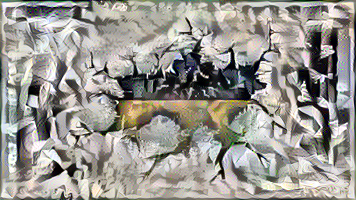
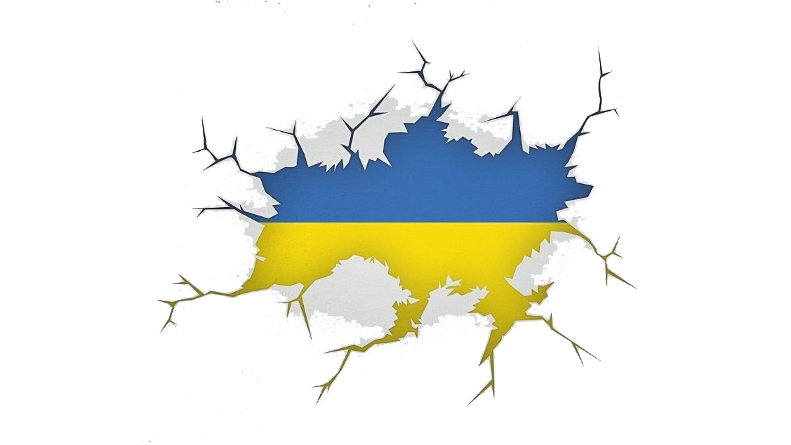
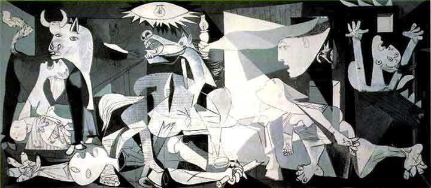

# My NFTs

## My passion for arts
In this page you can see all my NFTs and their respective meaning.
I'm  not a professional artist.
I'm only a nerd with the desire to innovate my local territory.
I love innovation and technologies, but at the same time i want to follow the tradition.

# 2020War
We are living a very bad period. I created this NFT for Ucraina and Ucranians people.

Part of the proceeds will be donated to ucranian people that suffers war.

## Output

The following image:

Is generated by a neural network. And in particular it takes as input an image of Ucraina and apply as style, the style of the Guernica painting.

See [input](#input)

Is generated by a neural network. And in particular it takes as input an image of Ucraina and apply as style, the style of the Guernica painting.

## Input
This NFT take as input 2 images:

### Content modified with the style of Guernica
This is an edited image taken from this [source](https://www.true-news.it/wp-content/uploads/2022/02/Cosa-succede-Russia-vince-contro-Ucraina.jpg)

### Style used to modify
The style to apply si taking form This is an edited image taken from the below painting representation of the famous opera Guernica:
